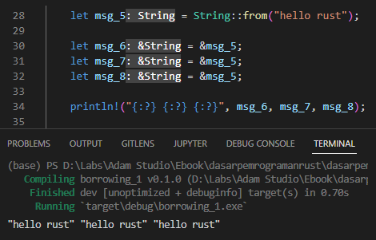
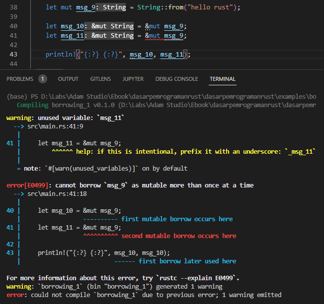
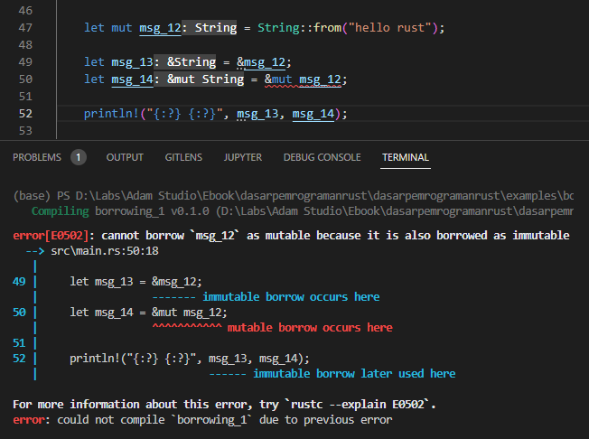

Pada chapter ini kita akan belajar tentang apa itu borrowing dalam Rust programming.

Sebelum masuk ke pembelajaran, penulis anjurkan untuk paham terlebih dahulu tentang [Basic Memory Management](/basic/basic-memory-management), [Pointer & References](/basic/pointer-references), dan juga konsep [Ownership](/basic/ownership). Ketiga topik tersebut dipelajari pada chapter sebelum ini.

## A.35.1. Konsep borrowing

Pada chapter sebelumnya kita telah belajar bahwa tipe data yang mengadopsi *move semantics* (seperti `String`), ketika digunakan pada operasi assignment maka owner-nya berpindah. Variabel yang sebelumnya adalah owner, setelah proses assignment menjadi invalid, karena owner data tersebut telah berpindah ke variabel baru. Efeknya, semua operasi yang dilakukan pada variabel owner sebelumnya menghasilkan error.

Sekarang perhatikan kode berikut:

```rust
let msg_1 = String::from("hello");
let msg_2 = msg_1;

println!("{:?}", msg_2);
println!("{:?}", msg_1);
```

Pada contoh di atas, statement print `msg_1` menghasilkan error karena variabel tersebut telah invalid setelah statement `let msg_2 = msg_1`.

Programmer harus ekstra hati-hati dan bijak dalam pengelolaan owner data, agar memory ter-manage dengan baik. Tapi kalau dipikir-pikir, repot juga kalau owner harus dilempar-lempar setiap selesai digunakan agar tidak error.

Salah satu cara yang bisa digunakan agar tidak terlalu repot adalah dengan menerapkan cloning (seperti yang sudah dibahas pada chapter sebelumnya). Namun ini bukan opsi yang baik karena boros memory, sedangkan di sisi lain programmer dianjurkan untuk efisien dalam penggunaan memory.

Solusi yang paling pas adalah dengan menerapkan **borrowing**. Borrowing artinya adalah meminjam. Pada konteks Rust programming, borrowing berarti meminjam data milik owner, dipinjam agar bisa diakses tanpa perlu memindah owner-nya. Kemudian setelah peminjaman selesai, data dikembalikan.

Cara meminjam data di Rust sangat mudah, yaitu:

- Untuk borrowing dengan level akses immutable/read-only, gunakan operator reference `&`

    ```rust
    let msg_3 = String::from("hello rust");
    let msg_4 = &msg_3; // <----- borrow operation

    println!("{:?}", msg_4); // output => hello rust
    println!("{:?}", msg_3); // output => hello rust
    ```

- Untuk borrowing dengan level akses mutable, gunakan operator reference `&mut`

    ```rust
    let mut msg_3 = String::from("hello");
    let msg_4 = &mut msg_3; // <----- mutable borrow operation

    *msg_4 = String::from("hello rust");

    println!("{:?}", msg_4); // output => hello rust
    println!("{:?}", msg_3); // output => hello rust
    ```

Di Rust, semua statement reference (baik mutable ataupun immutable) adalah operasi *borrowing*. Yang terjadi pada statement reference adalah data milik owner dipinjam dalam bentuk pointer. Pointer itu sendiri merupakan alamat memory yang mengarah ke data sebenarnya (milik owner).

Dari contoh di atas, bisa ditarik kesimpulan bahwa data string `hello rust` memiliki dua reference:

- Yang pertama adalah owner data, yaitu variabel `msg_3`
- Yang kedua adalah peminjam data, yaitu variabel pointer `msg_4`

## A.35.2. Rust Borrow Checker

Rust compiler memiliki 1 bagian bernama **borrow checker**, tugasnya untuk melakukan pengecekan pada source code apakah ada kode yang berhubungan dengan ownership dan borrowing, dan apakah kode tersebut mengikuti aturan borrowing yang sudah ditetapkan oleh Rust, atau tidak. Jika ada yang menyalahi aturan, maka borrow checker memunculkan error.

> Borrow checker sangat galak, pastikan kode yang ditulis mengikuti aturan yang berlaku di pemrograman Rust.

## A.35.3. Aturan borrowing

Aturan borrowing atau reference sempat disinggung pada chapter [Pointer & References](/basic/pointer-references), yang kurang lebih adalah:

- Dalam waktu yang sama, hanya boleh ada satu mutable reference atau banyak immutable reference (keduanya tidak bisa bersamaan, harus salah satu).
- Reference harus selalu valid.

Dua aturan tersebut wajib dipatuhi, jika tidak maka pasti muncul error.

Ok, selanjutnya mari kita test aturan tersebut.

## A.35.4. Borrowing mutable/immutable reference

### ◉ Contoh ke-1

Pada contoh berikut kita simulasikan 1 data memilik banyak immutable reference. Jika mengacu ke aturan di atas, maka hal seperti ini adalah boleh dan tidak menghasilkan error.

```rust
let msg_5 = String::from("hello rust");

let msg_6 = &msg_5;
let msg_7 = &msg_5;
let msg_8 = &msg_5;

println!("{:?} {:?} {:?}", msg_6, msg_7, msg_8);
```



### ◉ Contoh ke-2

Pada contoh ke-2 ini, kita coba simulasikan 1 data memilik 1 mutable reference. Harusnya tidak muncul error karena diperbolehkan di aturan yang tertulis.

```rust
let mut msg_9 = String::from("hello rust");

let msg_10 = &mut msg_9;

println!("{:?}", msg_10);
```


Bagaimana jika ada lebih dari 1 mutable reference? mari kita test.

```rust
let mut msg_9 = String::from("hello rust");

let msg_10 = &mut msg_9;
let msg_11 = &mut msg_9;

println!("{:?} {:?}", msg_10, msg_11);
```



Hasilnya error. Hal seperti ini tidak diperbolehkan. Sebuah data tidak boleh memiliki lebih dari 1 mutable reference.

### ◉ Contoh ke-3

Sekarang mari kita coba test lagi aturan di atas dengan skenario: dalam waktu yang sama, 1 data memiliki 1 mutable reference dan 1 immutable reference. Hasilnya seperti apa, (jika mengacu ke aturan, hal seperti ini adalah tidak diperbolehkan).

```rust
let mut msg_12 = String::from("hello rust");

let msg_13 = &msg_12;
let msg_14 = &mut msg_12;

println!("{:?} {:?}", msg_13, msg_14);
```



Hasilnya error, kenapa? karena memang tidak boleh.

Jadi sampai sini cukup jelas ya. Sebuah data dalam waktu yang sama hanya diperbolehkan memiliki satu atau lebih immutable reference, atau hanya 1 mutable reference, dan keduanya tidak bisa bersamaan dalam satu waktu (harus pilih salah satu).

## A.35.5. Borrowing valid/invalid reference

Kita telah belajar tentang [valid/invalid variable dan juga variable scope](/basic/ownership#a333-variable-scope) pada chapter sebelumnya. Sekarang kita akan coba gabungkan dua aspek tersebut dengan borrowing.

Silakan praktekan kode berikut:

```rust
fn main() {
    let mut fact_one = String::from("Arthas is the true lich king");

    change_value(&mut fact_one);

    let fact_two = &mut fact_one;
    println!("{:?}", fact_two);
}

fn change_value(txt: &mut String) {
    *txt = String::from("Bolvar is better lich king");
}
```

Pada kode di atas, ada satu buah mutable string bernama `fact_one`. String tersebut dipinjam menggunakan `&mut` (yang berarti adalah mutable borrow) sebagai argumen pemanggilan fungsi `change_value` yang isinya kurang lebih adalah perubahan isi data string pada variabel pointer.

Kemudian, ada operasi peminjaman lagi (yang juga mutable borrow) dari variabel `fact_one` ke `fact_one`.

Ketika program di run, hasilnya sukses. Kok bisa? padahal jelas di aturan tertulis bahwa dalam waktu yang sama tidak boleh ada lebih dari satu mutable borrow.


Kata **dalam waktu yang sama** disini adalah yang penting untuk dipahami. Arti *dalam waktu yang sama* adalah dalam 1 scope yang sama. Jika ada 2 scope, maka itu sudah bukan dalam waktu yang sama lagi.

Pada contoh di atas, statement `&mut fact_one` terjadi pada block fungsi `change_value`, lebih tepatnya pada parameter `txt` fungsi tersebut.

Kemudian setelah eksekusi fungsi tersebut selesai, yang terjadi adalah: reference yang tadinya dipinjam, sekarang dikembalikan. Tepat setelah eksekusi fungsi `change_value`, state data `fact_one` adalah tidak dipinjam siapapun. Tadinya memang ada yang meminjam (yaitu parameter `txt` di fungsi `change_value`), tapi setelah eksekusi fungsi `change_value` selesai, data dikembalikan lagi ke owner.

Proses dealokasi pada variable scope, jika terjadi pada variable reference maka yang sebenarnya terjadi adalah pengembalian data hasil operasi borrow ke pemilik aslinya.

Kemudian, ada operasi pinjam lagi, yaitu `let fact_two = &mut fact_one`. Statement borrow ini tidak menghasilkan error karena memang kondisi data `fact_one` sudah tidak ada yang meminjam. Bisa dibilang statement peminjaman ke-2 ini tidak terjadi dalam waktu yang sama dengan statement peminjaman pertama (pemanggilan fungsi `change_value`).

Pada fungsi `change_value`, variabel `txt` adalah valid saat fungsi dijalankan. Setelah pemanggilan fungsi selesai, variabel `txt` di-dealokasi. Namun karena variabel tersebut bukanlah owner, melainkan hanya borrower yang meminjam data dari owner `fact_one`, maka yang terjadi adalah: data yang dipinjam sekarang dikembalikan lagi ke pemilik aslinya.

Ok sampai sini semoga cukup jelas ya. Jika perlu silakan ulang-ulang penjelasan di atas.

## A.35.6. Borrowing pada block

Kita sudah cukup paham kapan waktu terjadinya alokasi alamat memory dan juga kapan proses dealokasi terjadi, yaitu ketika variabel **into scope** dan ketika variabel **out of scope**.

Scope disini adalah variable scope, yang maksudnya adalah block scope, bisa berupa block expression, fungsi, block seleksi kondisi `if`, dan juga jenis block lainnya.

Ok, sekarang mari kita praktekan beberapa jenis block untuk isolasi operasi borrowing. Dengan ini maka klausul **dalam satu waktu** akan terpenuhi.

Silakan modifikasi program sebelumnya menjadi seperti berikut:

```rust
fn main() {
    let mut fact_one = String::from("Arthas is the true lich king");
    println!("{:?}", fact_one);

    change_value(&mut fact_one);
    println!("{:?}", fact_one);

    {
        let fact_two = &mut fact_one;
        *fact_two = String::from("There must always be a lich king");
        println!("{:?}", fact_one);
    }

    if fact_one.contains("lich king") {
        let fact_three = &mut fact_one;
        *fact_three = String::from("Who is the real jailer?");
        println!("{:?}", fact_one);
    }

    for _ in 0..1 {
        let fact_four = &mut fact_one;
        *fact_four = String::from("Is it Zovaal or Primus?");
        println!("{:?}", fact_one);
    }
}

fn change_value(txt: &mut String) {
    *txt = String::from("Bolvar is better lich king");
}
```


Bisa dilihat, hasilnya tidak error, meskipun terjadi beberapa kali operasi mutable borrow, tapi karena kesemuanya terjadi di waktu yang berbeda (di scope yang berbeda) maka tidak error.

Pada kode di atas, mutable borrow terjadi di banyak tempat, yaitu di block fungsi `change_value`, block expression, block seleksi kondisi `if`, dan juga block perulangan `for`. Variabel pointer yang menampung data pinjaman akan valid di masing-masing block, kemudian menjadi invalid setelah eksekusi block selesai, dan yang terjadi setelah itu adalah pengembalian data yang telah dipinjam.

### ◉ Method `contains` milik `String`

Pada contoh di atas kita menerapkan method baru bernama `contains`. Method ini tersedia untuk tipe data `String`, gunanya adalah untuk mengecek apakah string memiliki substring `x`, dimana `x` adalah argumen pemanggilan method. Method ini mengembalikan nilai `bool`.

Contoh penerapan method `contains`:

```rust
let fact = String::from("There must always be a lich king");
println!("{:?}", fact.contains("lich king")); // output => true
println!("{:?}", fact.contains("bolvar"));    // output => false
```

O iya, pengecekan string-nya adalah case sensitive ya.

```rust
let fact = String::from("There must always be a lich king");
println!("{:?}", fact.contains("lich king")); // output => true
println!("{:?}", fact.contains("Lich King")); // output => false
```

> Lebih jelasnya mengenai tipe data string dan method yang tersedia pada tipe tersebut akan dibahas terpisah pada chapter [Tipe Data → String Custom Type vs &str](/basic/string-slice-vs-string-literal).

## A.35.7. Owner dan borrower data literal

Perhatikan statement berikut:

```rust
let number = 12;
let a = &number;

let text = String::from("hello");
let b = &text;
```

Pada kode di atas, variabel `number` dan `text` adalah *owner* data masing-masing. Sedangkan variabel `a` dan `b` adalah *borrower* atau peminjam data (yang lebih jelasnya akan dibahas pada chapter ). Sampai sini penulis rasa cukup jelas.

Selanjutnya, bagaimana dengan contoh ini:

```rust
let c = &24;
let d = &false;
let e = &String::from("rust");
```

Ketiga variabel, semuanya adalah *borrower* atau peminjam data. Lalu siapa *owner*-nya? jawabannya adalah tidak ada, atau silakan juga simpulkan bawah data tersebut owner-nya adalah program.

Yang lebih penting untuk diurusi pada contoh di atas bukan siapa owner-nya, melainkan bagaimana caranya agar data pinjaman tersebut tidak di-dealokasi saat block kode selesai.

Untuk sekarang sampai sini dulu. Kita akan bahas topik ini lebih mendetail pada chapter [Static item](/basic/static) dan [Lifetime](/basic/lifetime).

## A.35.8. Borrowing pada macro `println`

Pada pemanggilan macro println untuk menampilkan data yang mengadopsi *move semantics*, operasi borrowing tidak perlu dilakukan sewaktu pengisian argument. Karena macro tersebut secara cerdas akan melakukan opearsi peminjaman tanpa memindah owner-nya. Contoh:

```rust
let str1 = String::from("luwe");
println!("{:?}", str1);
```

... adalah ekuivalen dengan ...

```rust
let str2 = String::from("ngelak");
println!("{:?}", &str2);
```

Lebih jelasnya mengenai macro dibahas pada chapter [Macro](/wip/macro).

---

## Catatan chapter 📑

### ◉ Source code praktek

<pre>
    <a href="https://github.com/novalagung/dasarpemrogramanrust-example/tree/master/borrowing">
        github.com/novalagung/dasarpemrogramanrust-example/../borrowing
    </a>
</pre>

### ◉ Referensi

Beberapa referensi terkait chapter ini:

- https://doc.rust-lang.org/book/ch04-02-references-and-borrowing.html
- https://stackoverflow.com/questions/57225055/in-rust-can-you-own-a-string-literal

---
