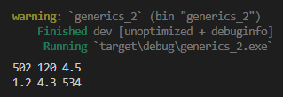
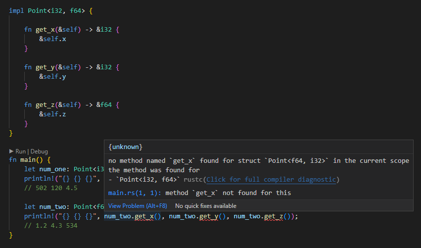

Chapter ini membahas tentang generics.

Generics sendiri merupakan salah satu fitur yang ada pada beberapa bahasa pemrograman (termasuk Rust), yang digunakan untuk menambahkan fleksibilitas dalam pemanfaatan tipe data pada suatu block kode. Dengan adanya generics, kita bisa menentukan tipe data yang digunakan pada parameter maupun return value sbuah block fungsi, method dan lainnya.

Generics dinotasikan dengan `<T>`. Kita sempat sedikit memanfaatkan generic pada chapter [Vector](/basic/vector) dimana dalam pendefinisian tipe data harus dituliskan juga tipe data item (via generics parameter), contoh `Vec<i32>`, `Vec<&str>`, dll. Kita juga sempat sedikit belajar tentang topik generic pada chapter [Traits](/basic/traits).

## A.37.1. Generics basic

Mari mulai pembahasan dengan sebauh contoh definisi fungsi yang memiliki generics.

```rust
fn do_something<T>(arg1: i32, arg2: T) {
    // ...
}
```

Pada contoh di atas, fungsi `do_something` didefinisikan dengan 2 buah parameter argument dan 1 buah parameter generics. Parameter argument pertama, yaitu `arg1` bertipe `i32`, kemudian diikuti parameter ke-2 bertipe `T` dimana `T` adalah parameter generic fungsi.

Dalam pemanggilan fungsi tersebut, `T` generics dan tipe data argument `arg2` harus sama. Contoh:

```rust
fn main() {
    do_something::<bool>(24, false);
}
```

Fungsi `do_something` dipanggil dengan disisipi argument `24` dan `false`. Parameter ke-2 fungsi tersebut tipe data-nya jelas `bool` karena pada argument-nya nilai `false` digunakan, oleh karena itu tipe data `bool` disisipkan pada parameter generics saat pemanggilan fungsi; dengan notasi penulisan adalah `::<tipe_data>`, posisi penulisannya di antara nama fungsi dan tanda kurung pemanggilan fungsi `(`.

Apa yang terjadi jika nilai `T` diisi dengan tipe data argument `arg2` berbeda? program error.


Ok sampai sini semoga jelas.

Khusus untuk fungsi yang generic parameter-nya dipergunakan sebagai tipe data parameter, maka boleh untuk tidak ditentukan tipe data-nya saat pemanggilan fungsi. Contohnya bisa dilihat pada kode berikut, dua statements ini adalah ekuivalen.

```rust
do_something::<bool>(24, false);
// T adalah bool, karena ditulis secara eksplisit

do_something(24, false);
// T adalah bool, karena diketahui dari tipe data argument.
// nilai `false` pasti tipe data-nya bool
```

Tipe data generic boleh tidak ditulis karena nilai `T` bisa diketahui dari argument pemanggilan fungsi. Sedangkan jika nilai `T` tidak digunakan sebagai tipe data parameter, maka wajib untuk di-isi nilai `T` saat pemanggilan fungsi.

O iya, jumlah parameter generics tidak ada batasan. Bisa saja ada lebih dari satu parameter generic yang didefinisikan, contohnya bisa dilihat pada fungsi `do_something_v2` ini yang memiliki 2 buah parameter generic, yaitu `R` dan `T`.

```rust
fn do_something_v2<R, T>(arg1: R, arg2: T) {
    // ...
}
```

Tipe `R` digunakan sebagai tipe parameter `arg1` dan tipe `T` pada parameter `arg2`.

## A.37.2. Mengasosiasikan traits ke parameter generic

Fungsi `do_something` yang telah dipraktikkan, susah untuk diisi dengan apapun. Memang parameter `arg1` tipe-nya adalah `i32`, dan harusnya mudah untuk bermain-main dengan parameter tersebut. Yang agak repot adalah parameter ke-2, yaitu `arg2` yang bertipe `T`.

```rust
fn do_something<T>(arg1: i32, arg2: T) {
    // ...
}
```

Parameter `arg2` hampir tidak bisa diapa-apakan.

- Misal mau di-print, tidak bisa, karena tipe `T` tidak implement trait [`std::fmt::Debug`](https://doc.rust-lang.org/std/fmt/trait.Debug.html).
- Misal diisi nilai numerik kemudian dijadikan operand operasi aritmatika, juga tidak bisa karena tipe `T` tidak implement trait [`std::ops::Add`](https://doc.rust-lang.org/std/ops/trait.Add.html), dan trait operasi bilangan lainnya.
- Misal diisi dengan nilai `bool`, tidak bisa digunakan pada seleksi kondisi `if` karena tipe `T` tidak implement trait [`std::cmp::PartialOrd`](https://doc.rust-lang.org/std/cmp/trait.PartialOrd.html), dan trait operasi logika lainnya.

Repot kan? Tapi tenang, tidak usah khawatir, ada soluasi agar tipe `T` bisa dimanfaatkan, yaitu dengan mengasosiasikan trait ke tipe data generic (sesuai kebutuhan).

### ◉ Contoh ke-1

Contoh pengaplikasiannya bisa dilihat pada kode berikut. Ada sebuah fungsi bernama `print_x_times` yang tugasnya adalah menampilkan data `T` sejumlah `x` kali, dimana `T` adalah parameter generics.

```rust
fn main() {
    print_x_times("Hello guys", 10);
}

fn print_x_times<T: std::fmt::Debug>(data: T, x: i32) {
    for _ in 0..x {
        println!("{:?}", data);
    }
}
```

Parameter generic `T` diasosiasikan dengan trait `Debug`, dengan ini maka kita akan bisa print parameter `data` yang tipe data-nya adalah `T`.

Untuk mengetes hasilnya, jalankan program. Bisa dilihat text `Hello guys` muncul 10x.


Cara untuk mengasosiasikan trait ke parameter generic adalah dengan menuliskannya dalam notasi berikut:

```rust
fn nama_fungsi<T: TraitYangInginDiasosiasikan>(arg1 ...) {
    // ...
}
```

### ◉ Contoh ke-2

Pada contoh ke-2 ini, dideklarasikan sebuah fungsi bernama `find_largest_number` yang tugasnya adalah mencari nilai maksimum dari sebuah tipe slice.

```rust
fn find_largest_number<T: std::cmp::PartialOrd>(list: &[T]) -> &T {
    let mut largest = &list[0];

    for item in list {
        if item > largest {
            largest = item;
        }
    }

    largest
}
```

Seperti yang sudah dibahas pada bagian sebelumnya, bahwa tipe `T` tidak akan bisa diapa-apakan kalau tidak diasosiasikan dengan trait. Maka pada contoh ini, tipe `T` diasosiasikan dengan trait `std::cmp::PartialOrd`. Benefitnya, semua data dengan tipe `T` bisa dipergunakan dalam operasi perbandingan.

> Tanpa adanya trait `std::cmp::PartialOrd`, maka statement `if item > largest { ... }` menghasilkan error.

Ok, sekarang panggil fungsi tersebut 2x, yang pertama diisi dengan data slice dari sebuah array, dan yang kedua data slice dari sebuah vector.

```rust
fn main() {
    let data_arr = [0, 1, 2, 3];
    let largest_number1 = find_largest_number(&data_arr);
    println!("largest_number1: {:?}", largest_number1);
    
    let data_vec = vec![4, 5, 6, 7];
    let largest_number2 = find_largest_number(&data_vec);
    println!("largest_number2: {:?}", largest_number2);
}
```

Hasilnya sesuai harapan.


### ◉ Contoh ke-3

Trait yang bisa diasosiasikan dengan parameter generics adalah semua jenis traits (tanpa terkecuali), termasuk custom trait yang kita buat sendiri.

Contohnya bisa dilihat pada kode berikut. Ada custom trait bernama `MyTrait` dideklarasikan, kemudian diasosiasikan dengan parameter generic `T` milik fungsi `do_something_v3`.

```rust
trait MyTrait {
    // methods declaration
}

fn do_something_v3<T: MyTrait>(arg1: T) {
    // do something
}
```

## A.37.3. Multi traits pada parameter generic

Bagaimana jika `T` perlu untuk diasosiasikan dengan banyak traits (lebih dari satu), apakah bisa? Bisa. Cara penulisannya kurang lebih seperti berikut:

```rust
// fn nama_fungsi<T: Trait1 + Trait2 + ...>(arg1 ...)

fn print_largest_number<T: std::cmp::PartialOrd + std::fmt::Debug>(list: &[T]) {
    let largest = find_largest_number::<T>(list);
    println!("largest number: {:?}", largest);
}
```

Fungsi di atas adalah fungsi baru, namanya `print_largest_number`, tugasnya adalah mencari nilai maksimum kemudian menampilkannya.

Proses pencarian nilai maksimum dilakukan dengan memanfaatkan fungsi `find_largest_number` yang sebelumnya sudah dibuat. Fungsi tersebut memerlukan trait `std::cmp::PartialOrd` untuk diasosiasikan dengan tipe data `T`.

Setelah nilai maksimum diketemukan, nilainya di-print ke stdout menggunakan macro `println`. Nilai maksimum ditampung pada variabel `largest`, tipe data-nya adalah `T`. Agar bisa di-print maka perlu diasosiasikan trait `std::fmt::Debug`.

Bisa dilihat cara penulisan asosiasi multi trait ke parameter generic seperti apa. Cukup tulis saja dengan separator tanda `+`.

## A.37.4. Keyword `where`

Selain notasi penulisan yang sudah dipelajari di atas ada lagi alternatif lainnya, yaitu menggunakan keyword `where`. Kurang lebih seperti berikut penerapannya.

```rust
fn print_largest_number<T: std::cmp::PartialOrd + std::fmt::Debug>(list: &[T]) {
    let largest = find_largest_number::<T>(list);
    println!("largest number: {:?}", largest);
}

// ... adalah ekuivalen dengan ...

fn print_largest_number<T>(list: &[T]) 
where
    T: std::cmp::PartialOrd + std::fmt::Debug,
{
    let largest = find_largest_number::<T>(list);
    println!("largest number: {:?}", largest);
}
```

Silakan gunakan sesuai preferensi dan kesepakatan tim. Kalau penulis lebih suka cara ke-2, karena terasa lebih rapi untuk penulisan fungsi yang ada banyak parameter generic beserta asosiasi traits-nya. Contohnya:

```rust
fn do_something<T, U, V>(arg1: T, arg2: U, arg3: V) 
where
    T: some::traits:TraitA,
    U: some::traits:TraitB + some::traits:TraitC + some::traits:TraitD,
    V: some::traits:TraitA + some::traits:TraitD,
{
    // do something
}
```

## A.37.5. Generics struct

Selain diterapkan di fungsi, generics bisa juga diterapkan di struct. Cara penulisannya, tambahkan notasi parameter generic di antara nama struct dan block struct.

```rust
struct Point<T, U> {
    x: T,
    y: T,
    z: U
}

fn main() {
    let num_one: Point<i32, f64> = Point { x: 502, y: 120, z: 4.5 };
    let num_two: Point<f64, i32> = Point { x: 1.2, y: 4.3, z: 534 };
}
```

Pada contoh di atas, struct `Point` memiliki 2 parameter generic. Kemudian struct tersebut digunakan untuk membuat dua variabel berbeda:

- Variabel `num_one`, bertipe `Point<i32, f64>`. Tipe data property `x` dan `y` adalah `i32` sedangkan tipe data property `z` adalah `f64`.
- Variabel `num_two`, bertipe `Point<f64, i32>`. Tipe data property `x` dan `y` adalah `f64` sedangkan tipe data property `z` adalah `i32`.

## A.37.6. Generics method

Generic bisa diterapkan pada method. Notasi penulisannya kurang lebih sama seperti pada penulisan method, hanya saja pada syntax `impl` perlu diikuti block parameter generics. Perbandingannya kurang lebih seperti berikut:

```rust
// method biasa
impl Square {
    fn x(&self) -> &i32 {
        &self.x
    }
}

// method dengan generic
impl<T> Square<T> {
    fn x(&self) -> &T {
        &self.x
    }
}
```

> Di syntax bagian `impl<T>` dan `Square<T>`, penulisan parameter generics di keduanya harus sama persis. Misal pada struct ada 3 buah parameter generic `Square<T, U, V>` maka pada syntax `impl` juga harus sama, yaitu `impl<T, U, V>`.
>
> Jika tidak sama akan muncul error.

Ok, sekarang mari kita praktikkan. Struct `Point` yang sudah dibuat, kita siapkan method-nya. Ada 3 buah method yang akan dibuat dan kesemuanya adalah method *getter* untuk masing-masing property struct (yaitu `x`, `y`, dan `z`).

```rust
struct Point<T, U> {
    x: T,
    y: T,
    z: U
}

impl<T, U> Point<T, U> {

    fn get_x(&self) -> &T {
        &self.x
    }

    fn get_y(&self) -> &T {
        &self.y
    }

    fn get_z(&self) -> &U {
        &self.z
    }
}
```

Bisa dilihat pada kode di atas, ada method `get_x` untuk mengambil nilai `x`. Nilai baliknya bertipe `T` dimana tipe tersebut juga dipakai sebagai tipe data `x`.

Kemudian coba gunakan struct `Point` untuk membuat satu atau dua variabel, lalu akses method-nya.

```rust
fn main() {
    let num_one: Point<i32, f64> = Point { x: 502, y: 120, z: 4.5 };
    println!("{} {} {}", num_one.get_x(), num_one.get_y(), num_one.get_z());
    // 502 120 4.5

    let num_two: Point<f64, i32> = Point { x: 1.2, y: 4.3, z: 534 };
    println!("{} {} {}", num_two.get_x(), num_two.get_y(), num_two.get_z());
    // 1.2 4.3 534
}
```

Hasilnya ketika di-run:



## A.37.7. Method khusus untuk spesifik tipe parameter generic tertentu

Pada contoh di atas, struct `Point<T, U>` bisa digunakan dalam banyak kombinasi tipe data, misalnya: `Point<i32, f64>`, `Point<i8, i32>`, `Point<f32, u64>`, dan lainya.

Di luar itu, bisa lho mendefinisikan method hanya untuk tipe parameter generic. Misalnya, method hanya bisa diakses ketika `T` adalah `i32` dan `U` adalah `f64`. Caranya kurang lebih seperti ini:

```rust
impl Point<i32, f64> {

    fn get_x(&self) -> &i32 {
        &self.x
    }

    fn get_y(&self) -> &i32 {
        &self.y
    }

    fn get_z(&self) -> &f64 {
        &self.z
    }
}
```

Block kode `impl` tidak diterapkan dengan notasi penulisan `impl<T, U> Point<T, U>`, melainkan `impl Point<i32, f64>`. Tipe `T` diganti dengan `i32` dan `U` diganti `f64`. Dengan penulisan yang seperti ini, maka method dalam block kode hanya bisa diakses ketika data memiliki tipe data sesuai dengan yang dideklarasikan di block kode `impl` (yang pada contoh di atas adalah `Point<i32, f64>`).

Bisa dilihat pada gambar berikut, sekarang statement pengaksesan method `num_two` menjadi error, karena method-method tersebut hanya tersedia untuk tipe data `Point<i32, f64>` sedangkan `num_two` bertipe `Point<f64, i32>`.



Jika ada keperluan untuk mendeklarasikan method lainnya khusus untuk tipe lainnya, cukup tulis lagi block `impl` diikuti dengan tipe yang diinginkan. Misalnya:

```rust
impl Point<i32, f64> {
    // method untuk tipe data Point<i32, f64>
}

impl Point<f32, u64> {
    // method untuk tipe data Point<f32, u64>
}

impl Point<i8, i64> {
    // method untuk tipe data Point<i8, i64>
}

// ...
```

## A.37.8. Generics enum

Generic juga bisa diterapkan pada tipe enum. Caranya tulis saja deklarasi parameter generic setelah nama enum, lalu gunakan parameter generic-nya sesuai kebutuhan.

Contohnya pada kode berikut ini, enum `Kendaraan` memiliki parameter generic `T` yang tipe tersebut dipakai pada value enum `Gledekan(T)`.

```rust
enum Kendaraan<T> {
    Skateboard,
    SepedaPancal,
    Gledekan(T),
}

let kendaraan1 = Kendaraan::<&str>::Skateboard;
let kendaraan2 = Kendaraan::<&str>::SepedaPancal;
let kendaraan3 = Kendaraan::<&str>::Gledekan("Artco");
```

---

## Catatan chapter 📑

### ◉ Source code praktik

<pre>
    <a href="https://github.com/novalagung/dasarpemrogramanrust-example/tree/master/generics">
        github.com/novalagung/dasarpemrogramanrust-example/../generics
    </a>
</pre>

### ◉ Referensi

- https://doc.rust-lang.org/book/ch10-01-syntax.html
- https://doc.rust-lang.org/std/fmt/trait.Debug.html
- https://doc.rust-lang.org/std/ops/trait.Add.html
- https://doc.rust-lang.org/std/cmp/trait.PartialOrd.html

---
