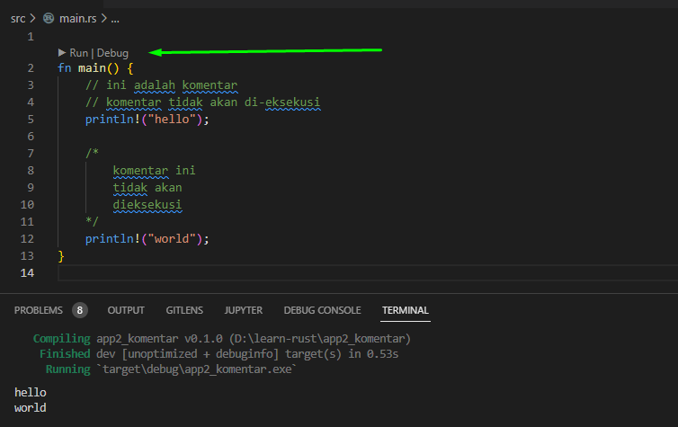

Pada chapter ini kita akan membahas tentang komentar pada pemrograman Rust. Ada [beberapa jenis komentar](https://doc.rust-lang.org/reference/comments.html) yang tersedia, namun untuk sekarang yang penting diketahui hanya 2.

## A.3.1. Baris komentar

Rust menggunakan double slash (`//`) sebagai penanda *line comment* atau baris komentar. Contoh:

```rust
fn main() {
    // ini adalah komentar
    // komentar tidak akan di-eksekusi
    println!("hello");
}
```

## A.3.2. Blok komentar

Blok komentar dituliskan dengan cara diawali `/*` dan diakhiri `*/`. Silakan tambahkan kode berikut dalam blok fungsi `main`.

```rust
/*
    komentar ini
    tidak akan
    dieksekusi
*/
println!("world");
```

Lalu run program tersebut. O iya, untuk kawan-kawan yang menggunakan editor VSCode dengan ekstensi `rust-analyzer` ter-install. Ada shortcut untuk run program yaitu dengan klik tombol `▶ Run` di atas definisi fungsi `main`.



Bisa dilihat, komentar tidak menghasilkan efek apa-apa pada program yang dibuat.

---

## Catatan chapter 📑

### ◉ Source code praktik

<pre>
    <a href="https://github.com/novalagung/dasarpemrogramanrust-example/tree/master/komentar">
        github.com/novalagung/dasarpemrogramanrust-example/../komentar
    </a>
</pre>

### ◉ Referensi

- https://doc.rust-lang.org/reference/comments.html

---

import Substack from '@site/src/components/Substack';

<Substack />
