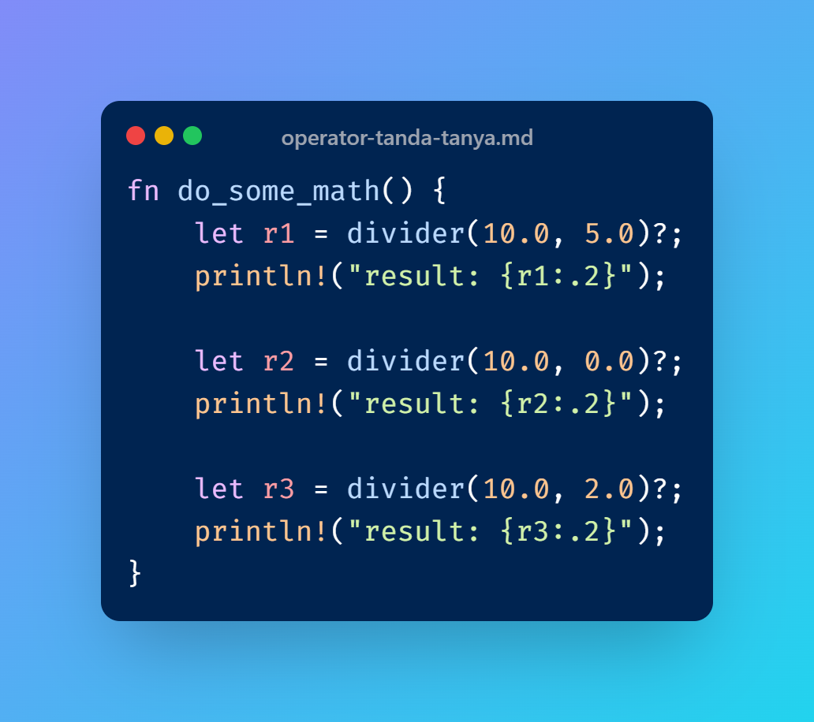
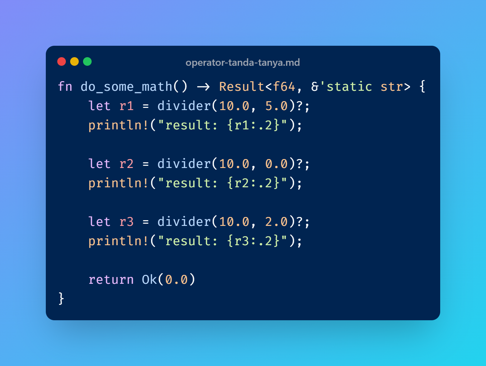

Operator `?` (atau *question mark operator*) adalah operator yang cukup berguna untuk operasi **unwrap** nilai dari tipe `Result<T, E>` atau `Option<T>`. Pada chapter ini kita akan belajar tentang operator tersebut.

## A.41.1. Operator ?

Operator `?` digunakan untuk operasi **unwrap** value dari tipe data `Result<T, E>` (dan `Option<T>`).

Penggunaannya terhadap tipe data `Result<T, E>` cukup umum untuk keperluan penanganan error (atau *error propagation*). Ketika suatu object dengan tipe tersebut di-unwrap menggunakan operator `?`, maka:

- Jika nilai object adalah bertipe `T`, maka yang dikembalikan adalah nilai `T`
- Jika nilai object adalah bertipe `E`, maka yang dikembalikan adalah nilai `E` atau error.

Agar lebih mudah memahami kegunaan dari operator ini, pembelajaran lebih baik dimulai dengan praktik kode yang didalamnya ada penerapan tipe data `Result` (atau `Option`). Di contoh berikut, tipe data `Result` kita pilih untuk praktek.

Silakan tulis kode berikut, pelajari, kemudian jalankan.

```rust
fn main() {
    do_some_math();
}

fn do_some_math() {
    let result1 = divider(10.0, 5.0);
    match result1 {
        Err(m) => println!("ERROR! {:?}", m),
        Ok(r) => println!("result: {r:.2}"),
    }
    
    let result2 = divider(10.0, 0.0);
    match result2 {
        Err(m) => println!("ERROR! {:?}", m),
        Ok(r) => println!("result: {r:.2}"),
    }
    
    let result3 = divider(10.0, 2.0);
    match result3 {
        Err(m) => println!("ERROR! {:?}", m),
        Ok(r) => println!("result: {r:.2}"),
    }
}

fn divider(a: f64, b: f64) -> Result<f64, &'static str> {
    if b == 0.0 {
        return Err("division by zero error");
    }

    let result = a / b;
    return Ok(result);
}
```

> Pada contoh di atas, operasi aritmatika ditempatkan dalam fungsi `do_some_math()` dan tidak langsung dalam fungsi `main()`. Ini disengaja karena berhubungan dengan contoh berikutnya. 

Fungsi `divider()` dibuat dengan kegunaan sangat spesifik, yaitu melakukan operasi aritmatika pembagian. Fungsi tersebut menghasilkan error jika ditemukan nilai pembagi adalah angka `0`.

Output program:


- Hasil statement `divider(10.0, 5.0)` memenuhi kriteria `Ok(r)`, maka outputnya adalah `result: 2.00`
- Hasil statement `divider(10.0, 0.0)` memenuhi kriteria `Err(m)`, maka outputnya adalah `ERROR! "division by zero error"`
- Hasil statement `divider(10.0, 2.0)` memenuhi kriteria `Ok(r)`, maka outputnya adalah `result: 5.00`

Sampai sini penulis rasa cukup jelas. Selanjutnya kode tersebut akan di-refactor, beberapa statement disederhanakan menggunakan operator `?`.

### ◉ Refactor ke-1

Ubah fungsi `do_some_math()` menjadi seperti ini:

```rust
fn do_some_math() {
    let r1 = divider(10.0, 5.0)?;
    println!("result: {r1:.2}");
    
    let r2 = divider(10.0, 0.0)?;
    println!("result: {r2:.2}");
    
    let r3 = divider(10.0, 2.0)?;
    println!("result: {r3:.2}");
}
```

Sekilas perbandingan fungsi sebelum dan setelah dimodifikasi bisa dilihat pada dua gambar berikut.

<table>
<tr>
<td>


</td>
<td>



</td>
</tr>
</table>

Implementasi operator `?` dilakukan dengan cukup menuliskannya setelah memanggil fungsi yang memiliki tipe nilai balik `Result<T, E>` (atau `Option<T>`) yang pada contoh ini adalah fungsi `divider()`. Operator tersebut meng-unwrap nilai balik fungsi `divider()` yang bertipe `Result<f64, &'static str>` dengan ketentuan:

- Jila nilai balik `Result<f64, &'static str>` berisi nilai `Ok(f64)`, maka nilai `f64` dikembalikan.

    - Statement `let r1 = divider(10.0, 5.0)?;`, variabel `r1` berisi nilai bertipe `f64`.
    - Statement `let r3 = divider(10.0, 2.0)?;`, variabel `r3` berisi nilai bertipe `f64`.

- Jila nilai balik `Result<f64, &'static str>` berisi nilai `Err(&'static str)`, maka nilai `&'static str` dikembalikan.

    - Statement `let r2 = divider(10.0, 0.0)?;`, variabel `r2` berisi nilai bertipe `&'static str`.

Sampai sini semoga cukup jelas.

Namun tunggu, kode baru yang telah ditulis sebenarnya tidak valid. Kode penulis buat untuk mempermudah mempelajari perbedaan cara konvensional vs menggunakan operator `?`. Ada beberapa hal lagi yang harus dilakukan sebelum kode benar-benar bisa digunakan.

### ◉ Refactor ke-2

Rust mewajibkan penggunaan operator `?` pada statement untuk diterapkan di dalam fungsi yang mengembalikan nilai balik bertipe `Result<T, E>` (atau `Option<T>`) tergantung tipe apa yang digunakan pada kode-kode di dalam blok fungsi tersebut. Bahkan meskipun nilai tidak digunakan, aturan tersebut tetap harus dipatuhi. Syarat ini hukumnya wajib.

Kembali ke contoh kode yang telah ditulis, kode tersebut harus dimodifikasi lagi menjadi seperti berikut:

```rust
fn do_some_math() -> Result<f64, &'static str> {
    let r1 = divider(10.0, 5.0)?;
    println!("result: {r1:.2}");
    
    let r2 = divider(10.0, 0.0)?;
    println!("result: {r2:.2}");
    
    let r3 = divider(10.0, 2.0)?;
    println!("result: {r3:.2}");

    return Ok(0.0)
}
```

Fungsi `do_some_math()` dimodifikasi dengan ditambahi nilai balik bertipe `Result<f64, &'static str>`. Karena sebenarnya kita tidak memerlukan fungsi `do_some_math()` untuk menghasilkan nilai balik, maka penulis hardcode saja nilai baliknya dengan nilai apapun yang penting valid, misalnya `Ok(0.0)`.

> Silakan gunakan nilai lainnya seperti `Ok(r1)`, `Ok(r2)` atau lainnya, bebas karena nilai ini ditulis di kode hanya agar syarat penerapan operator `?` terpenuhi.
>
> Boleh juga menggunakan notasi tipe lainnya seperti `Result<(), &'static str>` dimana dengan tipe tersebut untuk nilai balik bisa menggunakan `Ok(())`

Perbandingan terbaru fungsi sebelum dan setelah dimodifikasi bisa dilihat di bawah ini.

<table>
<tr>
<td>


</td>
<td>



</td>
</tr>
</table>

Sekarang coba jalankan program, dan lihat outputnya.


Output yang muncul hanya nilai variabel `r2`. Statement `let r2 = divider(10.0, 0.0)?;` dan seterusnya tidak menghasilkan output apapun, hal ini karena ketika proses unwrap nilai menggunakan operator `?` menghasilkan nilai `E`, fungsi langsung terhenti eksekusinya dan nilai `Err(E)` dikembalikan. Menandai akhir pemanggilan `do_some_math()` dengan informasi error pemanggilan statement `let r2 = divider(10.0, 0.0)?;` langsung dikembalikan.

### ◉ Refactor ke-3

Sebenarnya aturan di atas (kenapa fungsi yang didalamnya ada penerapan operator `?` diwajibkan untuk mengembalikan nilai balik bertipe `Result<T, E>` (atau `Option<T>`)) bukan hanya sebatas syarat, tapi memang benar-benar diperlukan.

Ketika operasi menghasilkan error, eksekusi blok fungsi menjadi terhenti dan error otomatis dikembalikan sebagai nilai balik fungsi. Hal ini berguna agar kita bisa melakukan pengecekan tambahan untuk mengidentifikasi apakah eksekusi fungsi menghasilkan error atau sukses.

> Inilah bagaimana penanganan error di Rust dilakukan.
>
> Lebih detailnya mengenai *error propagation* atau *error propagation* dibahas pada chapter [Error ➜ Recoverable Error & Error Handling](/basic/recoverable-error-handling).

Coba sekarang ubah lagi kode yang sudah ditulis, kita coba cek error apa yang muncul saat pemanggilan fungsi `do_some_math()`. Ubah isi fungsi `main()` dengan menambahkan keyword `match` untuk mengecek nilai balik eksekusi fungsi `do_some_math()`. Kode setelah diubah:

```rust
fn main() {
    match do_some_math() {
        Err(m) => println!("ERROR! {:?}", m),
        Ok(_) => {},
    }
}

fn do_some_math() -> Result<f64, &'static str> {
    let r1 = divider(10.0, 5.0)?;
    println!("result: {r1:.2}");
    
    let r2 = divider(10.0, 0.0)?;
    println!("result: {r2:.2}");
    
    let r3 = divider(10.0, 2.0)?;
    println!("result: {r3:.2}");

    return Ok(0.0)
}

fn divider(a: f64, b: f64) -> Result<f64, &'static str> {
    if b == 0.0 {
        return Err("division by zero error");
    }

    let result = a / b;
    return Ok(result);
}
```

Outputnya bisa dilihat di bawah ini. Pemanggilan fungsi `do_some_math()` memang menghasilkan error, yaitu saat eksekusi statement `let r2 = divider(10.0, 0.0)?;`. Informasi errornya bisa dilihat via blok `Err(m) => println!("ERROR! {:?}", m)`.


> Pada kode di atas terdapat penerapan statement `Ok(_) => {},`, pembahasan mengenai statement tersebut dibahas di chapter selanjutnya, yaitu [Pattern Matching](/basic/pattern-matching)

---

## Catatan chapter 📑

### ◉ Source code praktik

<pre>
    <a href="https://github.com/novalagung/dasarpemrogramanrust-example/tree/master/operator_tanda_tanya">
        github.com/novalagung/dasarpemrogramanrust-example/../operator_tanda_tanya
    </a>
</pre>

### ◉ Chapter relevan lainnya

- [Tipe Data ➜ Result](/basic/result-type)
- [Error ➜ Recoverable Error & Error Handling](/basic/recoverable-error-handling)

### ◉ Work in progress

- Contoh menggunakan tipe `Option<T>`

### ◉ Referensi

- https://doc.rust-lang.org/std/result/index.html
- https://doc.rust-lang.org/reference/expressions/operator-expr.html#the-question-mark-operator
- https://doc.rust-lang.org/book/ch09-02-recoverable-errors-with-result.html
