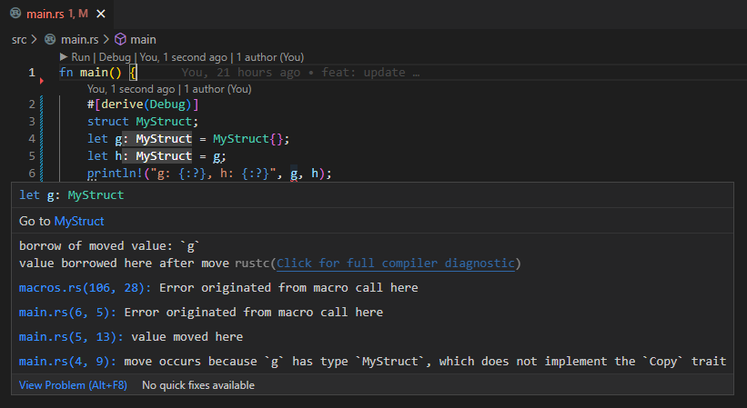
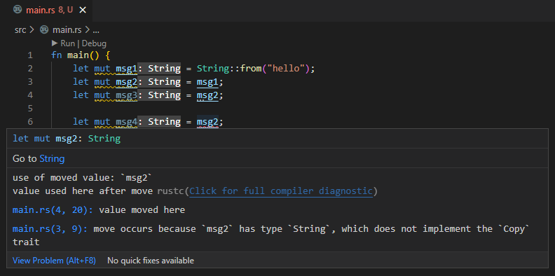
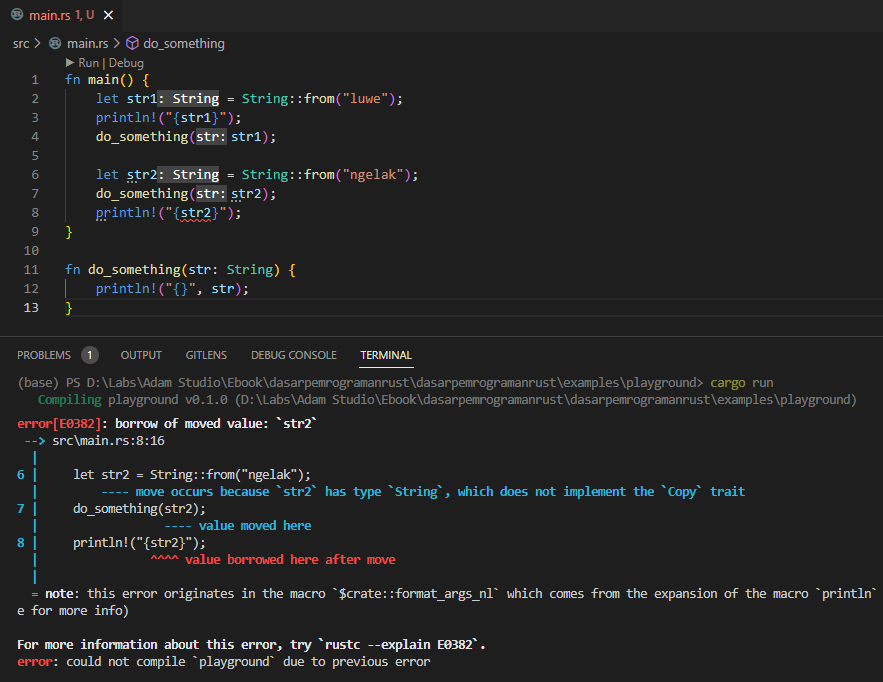

Chapter ini berisi pembahasan tentang ownership, bagaimana Rust melakukan manajemen memory dengan menerapkan approach ownership ini.

O iya, diwajibkan untuk mempelajari terlebih dahulu tentang dasar [Memory Management](/basic/basic-memory-management) dan juga [Pointer & References](/basic/pointer-references), yang keduanya adalah dibahas pada chapter sebelumnya. Jika pembaca mempelajari ebook ini secara urut maka tidak usah khawatir.

> Pembahasan pada chapter ini adalah salah satu hal yang paling penting untuk dipahami dalam Rust programming, karena topik yang berhubungan dengan memory management adalah hal yang krusial pada system programming.
>
> Silakan ulang-ulang chapter ini jika diperlukan.

## A.34.1. Konsep ownership

Ownership merupakan kumpulan aturan yang ada di Rust yang dijadikan acuan oleh compiler dalam pengelolahan memory.

Sudah disinggung pada chapter [Memory Management](/basic/basic-memory-management) bahwa Rust tidak menerapkan GC ataupun ARC dalam manajemen memory-nya. Rust membebankan manajemen memory pada penulis kode program, yaitu kita/programmer.

Aturan ownership ada banyak, dan programmer harus mengikutinya, karena jika tidak, maka proses kompilasi program dan eksekusi program akan gagal dan hasilnya error.

## A.34.2. Aturan ownership

Ada 3 aturan penting yang wajib diketahui:

- **Semua nilai/data/value di Rust memiliki owner**. Misal kita berbicara tentang deklarasi variabel dengan predefined value, maka value variabel adalah yang dimaksud dengan nilai/data/value, dan variabel itu sendiri adalah owner dari nilai/data/value tersebut.

- Pada waktu yang sama, **hanya boleh ada 1 owner**. Satu data, ownernya hanya satu.

- **Ketika eksekusi sebuah block scope selesai, maka owner dari data-data yang ada dalam scope tersebut akan di-drop atau di-dealokasi** (dengan pengecualian yaitu owner berpindah ke luar scope).

## A.34.3. Variable scope

Sebelum kita masuk ke pembahasan yang lebih detail mengenai ownership, mari pelajari terlebih dahulu tentang apa itu variable scope.

Variable scope maksudnya adalah di block scope mana suatu variabel dideklarasikan, dan dalam block scope tersebut variabel menjadi valid (bisa digunakan). Di luar scope-nya variabel menjadi tidak valid, tidak bisa digunakan.

Agar lebih jelas, silakan perhatikan kode berikut, tidak perlu dipraktikkan.

```rust
fn do_something() {
    let data_one = "one";
    // ...
}

fn main() {
    let data_two = "two";
    // ...

    {
        let data_three = "three";
        // ...
    }

    do_something();

    if true {
        let data_four = "four";
        // ...
    }
}
```

Program di atas memiliki 4 buah block kode:

- Block fungsi `main`, yang isinya adalah variabel `data_two` dan beberapa sub-block dan 1 buah pemanggilan fungsi. Di dalam block fungsi `main`, variabel `data_two` adalah valid, dan bisa digunakan dalam fungsi scope tersebut beserta sub-block lainnya (block expression dan block kode `if`).

- Block expression yang berisi variabel `data_three`. Pada block scope ini, variabel tersebut dan juga variable `data_two` adalah valid.

- Block fungsi `do_something`, yang isinya variabel `data_one`. Variabel tersebut hanya akan valid dalam block fungsi `do_something`.

- Block seleksi kondisi `if`. Variabel `data_four` berada dalam block ini, maka variabel tersebut adalah valid dalam block tersebut. Selain itu `data_two` juga valid dalam block seleksi kondisi `if` ini.

Intinya, variabel adalah valid ketika berada di dalam scope-nya (istilahnya *into scope*), dan variabel menjadi tidak valid atau invalid ketika keluar dari scope (istilahnya *out of scope*).

## A.34.4. Copy semantics vs. move semantics

Di atas sudah dijelaskan mengenai aturan ownership, yang salah satunya adalah setiap data yang ada di Rust memiliki owner, dan 1 data owner pasti 1 (tidak lebih).

Agar lebih jelas mari kita perhatikan contoh berikut:

```rust
let x = 24;
let y = x;
println!("x: {:?}, y: {:?}", x, y);
```


Variabel `x` dideklarasikan dengan nilai `24`, artinya variabel tersebut adalah owner dari data `24`. Kemudian variabel `x` dijadikan sebagai nilai variabel baru bernama `y`, dari sini apakah berarti owner data `24` adalah berpindah dari variabel `x` ke `y`? jawabannya adalah **tidak**.

Yang terjadi adalah data `24` milik owner `x` di-copy atau diduplikasi sebagai data baru yang owner-nya juga baru, yang pada contoh ini adalah variabel `y`.

Hasilnya, kedua variabel tersebut masing-masing adalah owner dari data yang berbeda, meskipun sumbernya adalah dari data yang sama. Perilaku ini disebut dengan **copy semantics**.

Semua tipe data primitif di Rust *by default* mengadopsi *copy semantics*. Ketika terjadi operasi assignment seperti pada contoh di atas, maka yang terjadi adalah data di-copy sebagai data baru, dengan owner baru, dan di sisi memory juga terjadi alokasi alamat baru untuk menampung data hasil copy tersebut.

> Copy semantics *by default* berlaku pada tipe primitif.
>
> Sudah dibahas pada chapter [Memory Management → Stack](/basic/basic-memory-management#a323-stack-memory) bahwa data primitif disimpan di stack dan pengaksesannya sangat cepat.
>
> Dengan ini, copy data pada tipe primitif meskipun menghasilkan alokasi memory baru, konsekuensinya tidak terlalu besar karena pengaksesannya sangat cepat.

Ok, lalu bagaimana dengan contoh ke-2 berikut? Apakah yang terjadi juga sama?

```rust
let a = String::from("hello rust");
let b = a;
println!("a: {:?}, b: {:?}", a, b);
```


Wow, malah muncul error. Kok bisa, padahal kode program sangat straightforward.

Jadi begini, sebelumnya sudah dibahas bahwa semua tipe data primitif mengadopsi *copy semantics*. Namun untuk tipe data non-primitif (yang salah satunya adalah custom type `String`) yang diadopsi adalah **move semantics**.

Pada *move semantics*, ketika ada operasi assignment seperti `let a = b;`, maka yang terjadi adalah owner dari data string `hello rust` berpindah dari variabel `a` ke `b`. Jadinya, mulai dari statement `let a = b;` dan statement seterusnya, owner dari data string `hello rust` bukan lagi variabel `a`, tetapi variabel `b`.

Ok, sampai sini cukup jelas. Tapi kenapa bisa error? Error muncul karena variabel `a` sudah tidak bisa digunakan lagi, data-nya (string `hello rust`) sudah berpindah ke variabel lain. Variabel `a` menjadi tidak valid setelah owner-nya berpindah, dan ini adalah penyebab kenapa pemanggilan variabel `a` via macro `println` menghasilkan error.

> Ingat, setiap data pasti punya owner, dan satu data ownernya hanya satu.
>
> Pada contoh di atas, owner data `hello rust` sudah berpindah dari variabel `a` ke `b`.

Intinya, variabel yang mengadopsi *move semantics*, setiap kali ada operasi assignment maka owner akan berpindah ke variabel baru.

Jika perlu, silakan coba praktikkan dengan tipe data non-primitif lainnya, seperti struct atau lainnya. Dengan pseudocode yang sama seperti contoh di atas, hasilnya adalah sama, yaitu error.

```rust
#[derive(Debug)]
struct MyStruct;

let g = MyStruct{};
let h = g;

println!("g: {:?}, h: {:?}", g, h);
```



> Copy semantics di Rust merupakan sifat yang dimiliki oleh trait `std::marker::Copy`.
>
> - Semua data primitif meng-implement trait `std::marker::Copy` yang berarti mengadopsi *copy semantics*.
> - Data non-primitif mengadopsi *move semantics*.
>
> Lebih jelasnya mengenai traits dibahas pada chapter [Traits](/basic/traits).

## A.34.5. Alokasi & dealokasi

Ok, masuk ke pembahasan selanjutnya, yaitu tentang alokasi dan dealokasi sebuah variabel dalam scope-nya.

Di sini kita akan gunakan custom type `String` sebagai contoh untuk mempelajari ownership. Untuk tipe non-primitif lainnya yang juga mengadopsi **move semantics** sebenarnya bisa dijadikan contoh. Tapi penulis memilih tipe `String` karena sering digunakan.

Sekarang perhatikan kode berikut:

```rust
fn main() {
    do_something();
}

fn do_something() {
    let mut k = String::from("hello");

    {
        let m = String::from("hello world");
        let n = String::from("from rust");
        k = n;
        
        println!("{:?}", m);
    }

    println!("{:?}", k);
}
```

Fungsi `main` dideklarasikan, isinya adalah pemanggilan fungsi `do_something`.

Di dalam fungsi `do_something`, variabel `k` dideklarasikan. Statement deklarasi tersebut adalah kapan proses alokasi memory berlangsung untuk data variabel `k`.

Kemudian ada block expression, dan di dalamnya terjadi lagi proses alokasi memory untuk data variabel `m` dengan nilai adalah string `hello world`, dan variabel `n` berisi string `from rust`.

Masih di dalam block expression, terjadi assignment operation, data variabel `n` berpindah ke variabel `k`. Lalu bagaimana nasib data string `hello` yang sebelumnya dimiliki oleh `n`? Yang terjadi adalah data tersebut tidak memiliki reference, dan nantinya di akhir fungsi akan di-dealokasi. Proses dealokasi terjadi setelah fungsi `do_something` selesai dieksekusi karena variable scope data tersebut adalah di block kode fungsi `do_something`.

Ok, masih dalam block expression. Ada statement print untuk data variable `m` yang merupakan statement terakhir di block expression tersebut. Setelah eksekusi block expression selesai, yang terjadi kemudian adalah:

- data variabel `m` di-dealokasi, karena sudah *out of scope*.
- data variabel `n` tidak di-dealokasi, karena sudah berpindah scope-nya ke fungsi `do_something`. Data tersebut sekarang ownernya adalah variabel `k` yang scope-nya ada di block fungsi `do_something`.

Kemudian variabel `k` di-print, dan fungsi selesai dieksekusi. Pada moment inilah semua data dalam scope block fungsi `do_something` di-dealokasi, karena kesemua data tersebut adalah *out of scope* dan tidak ada yang berpindah ke block fungsi lainnya.

Secara garis besar seperti itu proses manajemen memory pada Rust yang menerapkan konsep *ownership*.

## A.34.6. Transfer ownership

Di atas sudah dibahas bagaimana cara untuk transfer ownership data yang mengadopsi *move semantics*, yaitu cukup dengan statement assignment.

Berikut adalah contoh lain perihal transfer ownership. Data string yang owner awalnya adalah `msg1`, berpindah ke `msg2`, kemudian berpindah lagi ke `msg3`.

```rust
let msg1 = String::from("hello");
let msg2 = msg1;
let msg3 = msg2;
println!("{:?}", msg3);
```

Coba modifikasi sedikit kode tersebut, dengan menambahkan deklarasi variabel `msg4` yang nilai-nya didapat dari `msg2`.

```rust
let msg1 = String::from("hello");
let msg2 = msg1;
let msg3 = msg2;

let msg4 = msg2;
println!("{:?}", msg4);
```

Hasilnya adalah error, karena `msg2` sudah invalid.



Jika ingin memindah datanya ke `msg4`, maka gunakan statement `let msg4 = msg3`.

### ◉ Transfer ownership via return value

Transfer ownership data yang mengadopsi *move semantics* juga bisa dilakukan antar fungsi via return value. Sebagai contoh pada kode berikut, variabel `m` yang berada di dalam block expression berpindah ke luar scope yaitu ke block fungsi `do_something` via operasi assignment `k = m`. Kemudian berpindah lagi ke fungsi `main` via return value pemanggilan fungsi `do_something`.

```rust
fn main() {
    let msg = do_something();
    println!("{:?}", msg);
}
 
fn do_something() -> String {
    let mut k = String::from("hello");

    {
        let m = String::from("hello world");
        k = m;
    }

    return k;
}
```

### ◉ Transfer ownership via parameter/argument

Pemanggilan fungsi dengan menyisipkan argument juga menghasilkan proses transfer ownership untuk data yang mengadopsi *move semantics*. Contoh:

```rust
fn main() {
    let msg = String::from("hello rust");
    say_hello(msg);
}
 
fn say_hello(param: String) {
    println!("{:?}", param);
}
```

Pada kode di atas, data variabel `msg` owner-nya berpindah ke parameter bernama `param` milik fungsi `say_hello`.

Ok, sampai di sini semoga cukup jelas ya tentang bagaimana proses transfer ownership terjadi pada data yang mengadopsi *move semantics*.

Untuk data bertipe primitif (yang mengadopsi *copy semantics*) kita tidak perlu repot memikirkan dimana owner datanya, karena setiap operasi assignment, data akan di-copy dan hasilnya ada data baru dengan owner baru.

Tapi kalau dipikir-pikir justru lebih repot mengurus data yang ownernya berpindah saat assignment. Sebagai contoh, misal variabel digunakan di fungsi lain, kemudian digunakan lagi di scope asalnya. Repot juga kalau setiap saat harus dikembalikan lagi via return value.

Misalnya pada kasus berikut ini. Hasilnya pasti error, karena variabel `msg` di print setelah owner-nya berpindah ke fungsi `say_hello`.

```rust
fn main() {
    let msg = String::from("hello rust");
    say_hello(msg);
    println!("{:?}", msg);
}
 
fn say_hello(param: String) {
    println!("{:?}", param);
}
```

Lalu apa solusinya? apakah harus mengembalikannya via return value? Contohnya seperti kode berikut:

```rust
fn main() {
    let mut msg = String::from("hello rust");   // 1. awalnya data di sini
    msg = say_hello(msg);                       // 3. lalu dikembalikan lagi ke sini
    println!("{:?}", msg);
}
 
fn say_hello(param: String) -> String {         // 2. kemudian berpindah ke sini
    println!("{:?}", param);
    param
}
```

Boleh-boleh saja sebenarnya pakai approach tersebut, tapi malah makin repot bukan?

Ada lagi solusi lainnya yang bisa digunakan, yaitu dengan memanfaatkan method `clone` untuk cloning data.

## A.34.7. Clone data

Semua tipe data yang mengadopsi *move semantics* meng-implement trait `std::clone::Clone`. Trait ini memiliki method bernama `clone` yang gunanya adalah menduplikasi atau clonging data. Cukup panggil saja method tersebut, maka data akan ter-cloning.

> Lebih jelasnya mengenai traits dibahas pada chapter [Traits](/basic/traits).

Kita akan terapkan pada kode sebelumnya, hasilnya kurang lebih seperti ini. Pada argument pemanggilan fungsi `say_hello` disisipkan data cloning via statement `msg.clone()`.

```rust
fn main() {
    let msg = String::from("hello rust");
    say_hello(msg.clone());
    println!("{:?}", msg);
}
 
fn say_hello(param: String) {
    println!("{:?}", param);
}
```

Ok, dengan ini masalah untuk me-reuse data yang bisa berpindah ownernya dianggap beres. Memang beres, tapi apakah cara ini baik kalau dilihat dari sudut pandang memory management?

Konsekuensi dari cloning data adalah terjadi proses alokasi lagi di memory. Data akan di-duplikasi dan dialokasikan ke alamat memory baru, jadinya kurang efisien. Ditambah lagi, jika kita mengacu ke penjelasan pada chapter [Memory Management → Heap Memory](/basic/basic-memory-management#a324-heap-memory), data `String` isinya disimpan di heap memory yang pengaksesannya lebih lambat dibanding pengaksesan data stack. Dari sini bisa disimpulkan bahwa cloning bukan solusi yang paling baik (kecuali terpaksa).

**Solusi yang lebih baik adalah dengan melakukan operasi pinjam data dari owner aslinya tanpa perlu melakukan operasi perpindahan owner**, yang pada Rust programming disebut dengan **borrowing**.

Kita sebenarnya sudah menerapkannya beberapa kali pada chapter yang lalu, tapi kita akan bahas lagi lebih detail (dari sudut pandang ownership) pada chapter [Borrowing](/basic/borrowing).

## A.34.8. Ownership pada data literal

Kita akan bahas topik ini pada chapter berikutnya, yaitu chapter [Borrowing](/basic/borrowing#a347-owner-dan-borrower-pada-literal).

## A.34.9. *Move semantics* pada macro `println`

Ada yang unik dengan macro `println`. Silakan coba kode berikut agar terlihat keunikannya.

```rust
fn main() {
    let str1 = String::from("luwe");
    println!("{str1}");
    do_something(str1);
    
    let str2 = String::from("ngelak");
    do_something(str2);
    println!("{str2}");
}

fn do_something(str: String) {
    println!("{}", str);
}
```

Jika dijalankan ada error di statement terakhir fungsi `main`.



Seperti yang sudah dibahas, bahwa tipe `String` mengadopsi move semantics. Ketika data bertipe ini digunakan pada operasi assignment seperti contohnya sebagai argument pemanggilan fungsi, maka owner berpindah.

Tapi entah kenapa, khusus dalam pemanggilan macro `println`, owner-nya tidak berpindah. Ajaib.

Silakan lihat sendiri di gambar di atas, ketika `str1` digunakan pada macro `println`, kemudian digunakan lagi pada argument pemanggilan fungsi `do_something`, hasilnya tidak error.

Akan tetapi ketika digunakan pada pemanggilan fungsi terlebih dahulu, jika digunakan lagi di statement di bawahnya hasilnya error.

Ini adalah keistimewaan dari macro `println` dan beberapa macro untuk keperluan printing lainnya.

Lebih jelasnya mengenai macro dibahas pada chapter [Macro](#/wip/macro).

---

## Catatan chapter 📑

### ◉ Source code praktik

<pre>
    <a href="https://github.com/novalagung/dasarpemrogramanrust-example/tree/master/ownership">
        github.com/novalagung/dasarpemrogramanrust-example/../ownership
    </a>
</pre>

### ◉ Referensi

- https://doc.rust-lang.org/book/ch04-01-what-is-ownership.html
- https://doc.rust-lang.org/std/marker/trait.Copy.html
- https://doc.rust-lang.org/nomicon/ownership.html
