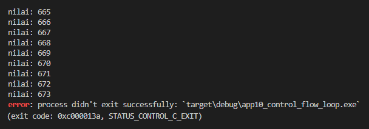
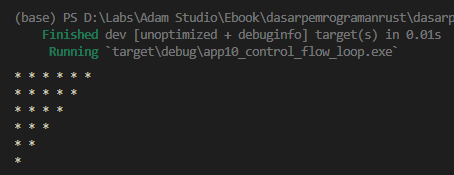
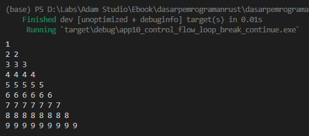

Selain keyword `while`, ada juga keyword `loop` yang fungsi dasarnya adalah sama, yaitu untuk perulangan.

## A.11.1. Keyword `loop`

Notasi penulisan dan cara penggunaan `loop` ada sedikit beda dibanding `while`. Keyword `loop` tidak membutuhkan argument. Blok kode loop akan terus dieksekusi selama program tidak di-stop.

Silakan coba praktikkan kode berikut. Angka `i` akan ditampilkan setiap perulangan kemudian di-increment nilainya. Angka akan muncul terus sampai aplikasi di-stop.

```rust
fn main() {
    let mut i = 0;

    loop {
        println!("nilai: {i}");
        i += 1;
    }
}
```



## A.11.2. Keyword `break`

`loop` menghasilkan perulangan tanpa henti, lalu bagaimana cara stop-nya? Di sinilah keyword `break` berperan. `break` digunakan untuk menghentikan paksa eksekusi blok kode perulangan. Biasanya keyword ini digunakan dalam kondisi tertentu (sesuai kebutuhan), misalnya `perulangan harus berhenti ketika nilai i di atas max`.

Mari kita ubah kode di atas dengan menambahkan kondisi untuk menghentikan perulangan jika `i` nilainya lebih dari `5`.

```rust
let mut i = 0;
let max = 5;

loop {
    println!("nilai: {i}");
    i += 1;
    if i > max {
        break;
    }
}

println!("perulangan selesai");
```


> Penulisan `break` boleh tanpa diakhiri semicolon `;`

## A.11.3. Nested `loop`

Cara menerapkan nested loop (atau `loop` di dalam `loop`), tulis saja statement `loop` di dalam `loop` sesuai kebutuhan.

Pada kode berikut, teknik nested loop diterapkan untuk membuat bentuk segitiga menggunakan karakter `*`.

```rust
let mut i = 0;
let max = 5;

loop {
    let mut j = max;
    let max_inner = i;

    loop {
        print!("* ");
        j -= 1;
        if j < max_inner {
            break;
        }
    }
    
    println!();

    i += 1;
    if i > max {
        break;
    }
}
```



## A.11.4. Keyword `continue`

`continue` digunakan untuk melanjutkan paksa sebuah perulangan, kebalikan dari `break` yang fungsinya menghentikan paksa sebuah perulangan.

Source code berikut murapakan contoh penerapan `continue`. Variabel `i` berperan sebagai counter perulangan. Jika nilai `i` adalah ganjil, maka perulangan dipaksa lanjut ke iterasi berikutnya. Dengan ini maka macro `println` hanya akan menampilkan nilai genap. Dan program akan berhenti jika `i` nilainya lebih dari `max`.

```rust
let mut i = 0;
let max = 15;

loop {
    i += 1;

    if i % 2 == 1 {
        continue;
    }

    println!("nilai i: {i}");

    if i > max {
        break;
    }
}
```


## A.11.5. Label perulangan

Statement perulangan menggunakan `loop` bisa ditandai dengan label. Manfaat dari penggunaan label adalah bisa mengeksekusi `break` atau `continue` ke perulangan di luar blok kode perulangan dimana statement itu berada. Umumnya label perulangan dipergunakan pada nested loop, dimana ada kebutuhan untuk menghentikan/melanjutkan paksa perulangan terluar.

Berikut adalah notasi penulisan loop dengan dan tanpa label. Nama label diawali dengan tanda petik `'`.

```rust
// loop biasa
loop {
    // statements
    break;
}

// loop dengan label
'namaLabel: loop {
    // statements
    break 'namaLabel;
}
```

Mari kita pelajari dan praktikkan kode berikut ini. Dibawah ini adalah sebuah program sederhana menampilkan angka yang hasilnya bisa dilihat digambar dibawahnya. Perulangan di level 2 akan dihentikan secara paksa ketika `j > i`. Sedangkan perulangan level pertama atau terluar (dengan label `'mainLoop`) akan dihentikan paksa dari perulangan level 2 jika kondisi `i > max`.

```rust
let mut i = 0;
let max = 9;

'mainLoop: loop {
    i += 1;
    let mut j = 0;

    loop {
        if i > max {
            break 'mainLoop;
        }

        j += 1;
        if j > i {
            break;
        }

        print!("{i} ");
    }

    println!();
}
```



## A.11.6. Returning from `loop`

*Returning from `loop`* merupakan teknik pemanfaatan `loop` dan `break` untuk menampung sebuah return value dari blok kode perulangan `loop`. Agar lebih jelas, silakan coba kode berikut:

```rust
let mut counter = 0;

let result = loop {
    counter += 1;

    if counter == 10 {
        break counter * 2;
    }
};

println!("result: {result}");
```

Pada kode di atas, variabel `result` dideklarasikan dengan predefined value adalah blok kode `loop`. Di sini artinya variabel `result` isinya bukan blok kode perulangan `loop`, melainkan isinya adalah apapun yang dituliskan setelah keyword `break`. Unik ya?

Variabel `counter` yang nilai awalnya `0`, di-increment dalam perulangan. Ketika nilai `counter` adalah `10`, nilai `counter * 2` dijadikan sebagai return value. Dengan ini maka variabel `result` nilainya adalah `20`.


---

## Catatan chapter 📑

### ◉ Source code praktik

<pre>
    <a href="https://github.com/novalagung/dasarpemrogramanrust-example/tree/master/perulangan_loop_break_continue_label">
        github.com/novalagung/dasarpemrogramanrust-example/../perulangan_loop_break_continue_label
    </a>
</pre>

### ◉ Referensi

- https://doc.rust-lang.org/book/ch03-05-control-flow.html
- https://doc.rust-lang.org/std/keyword.loop.html
- https://doc.rust-lang.org/std/keyword.break.html
- https://doc.rust-lang.org/std/keyword.continue.html
- https://doc.rust-lang.org/rust-by-example/flow_control/loop.html
- https://doc.rust-lang.org/rust-by-example/flow_control/loop/nested.html
- https://doc.rust-lang.org/rust-by-example/flow_control/loop/return.html
- https://doc.rust-lang.org/reference/expressions/loop-expr.html
