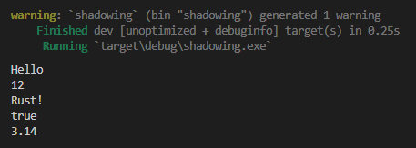

Pada chapter ini kita akan belajar tentang shadowing pada variable dan apa perbedaannya dibanding variable mutable.

## A.31.1 Konsep variable shadowing

Variable shadowing adalah istilah untuk variable yang dideklarasikan dalam sebuah block, yang variabel tersebut memiliki nama sama persis dengan variable pendahulunya (baik dalam scope yang sama ataupun variable lain yang berada di luar current scope).

Penulis tekankan di sini, meskipun namanya sama, variabel-variabel tersebut dianggap variabel yang benar-benar berbeda oleh Rust, tipe datanya bisa jadi juga berbeda.

Ciri khas variable shadowing adalah deklarasi selalu menggunakan keyword `let`. Contoh penerapannya:

```rust
fn main() {
    let some_data = "Hello";
    println!("{}", some_data);
    // output => Hello

    let some_data = 12;
    println!("{}", some_data);
    // output => 12

    let some_data = "Rust!";
    println!("{}", some_data);
    // output => Rust!

    let mut some_data = false;
    some_data = true;
    println!("{}", some_data);
    // output => true

    let some_data = 3.14;
    println!("{}", some_data);
    // output => 3.14
}
```



Bisa dilihat ada banyak variabel dengan nama `some_data` dideklarasikan dalam block fungsi `main`. Kesemuanya dideklarasikan menggunakan keyword `let`, ada yang immutable ada juga yang mutable.

**Variable shadowing BERBEDA dengan variable mutable**. Pada variable mutable, saat deklarasinya, di belakang layar terjadi proses alokasi alamat memory untuk menampung data, kemudian saat ada perubahan nilai, maka data yang baru disimpan ke alamat memory yang sama menggantikan data sebelumnya.

Pada variable shadowing, yang terjadi di balik layar adalah: ketika ada deklarasi variabel baru menggunakan keyword `let` dan namanya sama, maka dianggap sebagai variabel baru, dan Rust akan mengalokasikan alamat memory baru untuk menampung data variable baru tersebut.

Lebih jelasnya mengenai memory management akan dibahas secara terpisah pada chapter [Memory Management](/basic/basic-memory-management). Untuk sekarang mari lanjut pembahasan tentang variable shadowing.

## A.31.2 Shadowing pada block berbeda

Variable shadowing bisa terjadi dalam satu scope yang sama, bisa juga terjadi pada scope yang berbeda. Pada case ke-2 (scope yang berbeda), variabel baru hanya akan valid pada block scope itu saja, dan tidak mempengaruhi data variable di luar block.

Agar lebih jelas silakan pelajari contoh berikut:

```rust
fn main() {
    let name = "Orgrim Doomhammer";
    let mut race = "Orc";
    let mut number = 27;

    println!("{}\t {}\t {}", name, race, number);

    {
        let name = "Sylvanas Windrunner";
        race = "Undead";
        let number = 24;
        
        println!("{}\t {}\t {}", name, race, number);
    }
        
    println!("{}\t {}\t {}", name, race, number);
}
```


Pada contoh di atas, ada 3 variabel dideklarasikan kemudian di-print, yaitu `name`, `race`, dan `number`. Variabel `name` adalah immutable, dan 2 variable lainnya adalah mutable. Ok, kita akan bahas variable tersebut satu per satu.

### ◉ Variable `name`

Variabel `name` dideklarasikan dengan nilai awal adalah `Orgrim Doomhammer`, kemudian diikuti block statement yang isinya adalah variable shadowing bernama `name` dengan value `Sylvanas Windrunner`. Variabel tersebut ketika di-print dalam block, nilainya adalah `Sylvanas Windrunner`.

Setelah eksekusi block selesai, apapun yang ada di-dalam block tersebut dianggap selesai, dan tidak mempengaruhi nilai di scope atasnya. Pada contoh, nilai variable `name` setelah eksekusi block adalah tetap `Orgrim Doomhammer` (tidak berubah menjadi `Sylvanas Windrunner`).

### ◉ Variable `race`

Variabel `race` dideklarasikan mutable dengan nilai awal `Orc`. Di dalam block baru, variabel tersebut diubah nilainya. Perhatikan baik-baik statement `race = "Undead"`, statement ini adalah perubahan nilai, bukan deklarasi variable shadowing. Efeknya apa? setelah block selesai dieksekusi, nilai `race` adalah `Undead` karena memang sengaja diubah nilainya dari dalam block.

Penulis tekankan, variabel shadowing ciri khasnya adalah pasti diawali keyword `let`. Jika tidak ada keyword tersebut, maka statement adalah operasi perubahan nilai, bukan deklarasi variable shadowing.

### ◉ Variable `number`

Variabel `number` dideklarasikan mutable dengan nilai awal `27`. Kemudian pada block terjadi deklarasi variable shadowing `let number = 24`. Meskipun variabel ini adalah mutable, yang terjadi di dalam block adalah variable shadowing karena statement diawali dengan keyword `let`.

Setelah eksekusi block selesai, nilai `number` pada scope tidak berubah, yaitu `27`.

---

## Catatan chapter 📑

### ◉ Source code praktek

<pre>
    <a href="https://github.com/novalagung/dasarpemrogramanrust-example/tree/master/shadowing">
        github.com/novalagung/dasarpemrogramanrust-example/../shadowing
    </a>
</pre>

### ◉ Referensi

- https://doc.rust-lang.org/rust-by-example/variable_bindings/scope.html

---
