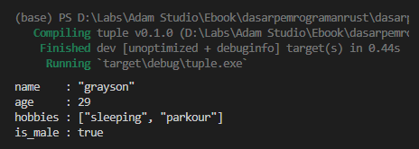
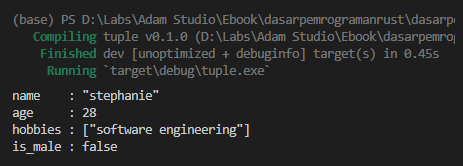

Pada chapter ini kita akan membahas tentang tipe data kolektif bernama Tuple.

## A.15.1. Tipe data tuple

Tuple tipe data yang isinya koleksi dari banyak data atau value, yang bisa jadi tiap value tersebut tipe datanya berbeda satu sama lain. Tuple biasa digunakan untuk menampung data yang *heterogeneous* atau campuran.

> Tipe ini tidak diciptakan sebagai pengganti array.
>
> Cukup mudah untuk mengidentifikasi kapan harus menggunakan tuple, contohnya: jika ada kebutuhan data harus bisa di-iterate, atau data memiliki pattern yg pasti seperti size-nya fixed, atau tipe datanya *homogeneous* atau sejenis, ... maka baiknya gunakan tipe data array atau slice.

Tuple dibuat dengan notasi penulisan diapit tanpda `(` dan `)`. Contoh deklarasi tuple:

```rust
let tuple_a = ("jason", 27, ["racing", "working out"], true);
println!("tuple_a: {:?}", tuple_a);
```

Variabel `tuple_a` di atas bertipe data tuple, dengan tipe data spesifik per-elemennya bervariasi, ada string, numerik, array `[&str; 2]`, dan boolean.

Untuk menampilkan nilai per-elemen, gunakan notasi `.N` dimana `N` merupakan indeks elemen. Contohnya seperti berikut:

```rust
println!("index 0: {:?}", tuple_a.0);
println!("index 1: {:?}", tuple_a.1);
println!("index 2: {:?} {:?}", tuple_a.2[0], tuple_a.2[1]);
println!("index 3: {:?}", tuple_a.3);
```


Data pada `tuple_a` indeks ke-2 bertipe slice, untuk mengakses tiap elemennya bisa menggunakan notasi pengaksesan indeks array/slice seperti biasa.

- Tuple `tuple_a.2` nilainya `["racing", "working out"]`
- Tuple `tuple_a.2[0]` nilainya `"racing"`
- Tuple `tuple_a.2[1]` nilainya `"working out"`

## A.15.2. Mutable tuple

Cara untuk membuat tuple menjadi data yang mutable adalah dengan menambahkan `mut` pada saat deklarasi. Pada contoh berikut variabel `tuple_b` dideklarasikan sebagai mutable dengan teknik *manifest typing*.

```rust
let mut tuple_b: (&str, i32, [&str; 2], bool) = ("default", 0, [""; 2], false);
tuple_b.0 = "damian";
tuple_b.1 = 18;
tuple_b.2 = ["gaming", "adventuring"];
tuple_b.3 = true;

println!("tuple_b: {:?}", tuple_b);
```


## A.15.3. Notasi deklarasi tuple

Ada beberapa cara yang bisa digunakan dalam deklarasi tuple.

### ◉ Type inference

Cara pertama menggunakan teknik *type inference* seperti yang sudah dipraktikkan pada contoh pertama.

```rust
let tuple_a = ("jason", 27, ["racing", "working out"], true);
```

### ◉ Manifest typing

Bisa juga menggunakan teknik deklarasi *manifest typing*, biasanya diterapkan pada pembuatan mutable tuple dengan *predefined value* adalah nilai kosong seperti empty string, 0, dan lainnya.

```rust
let tuple_b: (&str, i32, [&str; 2], bool) = ("damian", 18, ["gaming", "adventuring"], true);
```

Contoh lain:

```rust
let mut tuple_b: (&str, i32, [&str; 2], bool) = ("default", 0, [""; 2], false);
tuple_b.0 = "damian";
tuple_b.1 = 18;
tuple_b.2 = ["gaming", "adventuring"];
tuple_b.3 = true;
```



### ◉ Packing tuple

Adalah cara pembuatan tuple yang dimana nilai elemenya bersumber dari variabel lain.

```rust
let name = "grayson";
let age = 29;
let hobbies = ["sleeping", "parkour"];

let tuple_c = (name, age, hobbies);

println!("name    : {:?}", tuple_c.0);
println!("age     : {:?}", tuple_c.1);
println!("hobbies : {:?}", tuple_c.2);
```

> Istilah packing tuple bukan resmi dari official Rust. Istilah ini penulis buat sendiri.

### ◉ Unpacking tuple

Unpacking tuple adalah kebalikan dari packing tuple. Data tuple di-distribusikan ke banyak variabel dalam 1 baris deklarasi.

```rust
let tuple_d = ("stephanie", 28, ["software engineering"], false);
let (name, age, hobbies, is_male) = tuple_d;

println!("name    : {:?}", name);
println!("age     : {:?}", age);
println!("hobbies : {:?}", hobbies);
println!("is_male : {:?}", is_male);
```



> Pada bahasa lain teknik ini biasa disebut dengan destructuring assignment

## A.15.4. Tuple `()`

Tuple bisa didefinisikan dengan tanpa isi dengan menggunakan `()`.

```rust
let tuple_d = ();
println!("{:?}", tuple_d);
```

## A.15.5. Tuple Structs

Pembahasan mengenai tuple structs dibahas pada chapter [Struct](/basic/struct#a247-tuple-struct).

---

## Catatan chapter 📑

### ◉ Source code praktik

<pre>
    <a href="https://github.com/novalagung/dasarpemrogramanrust-example/tree/master/tuple">
        github.com/novalagung/dasarpemrogramanrust-example/../tuple
    </a>
</pre>

### ◉ Referensi

- https://doc.rust-lang.org/std/primitive.tuple.html
- https://doc.rust-lang.org/rust-by-example/primitives/tuples.html

---

import Substack from '@site/src/components/Substack';

<Substack />
